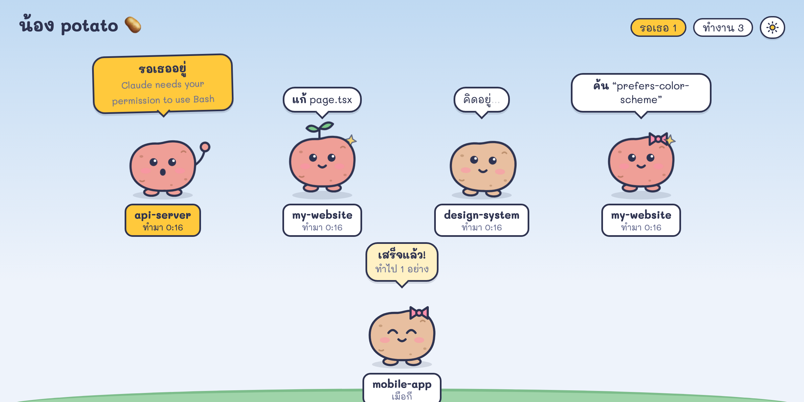
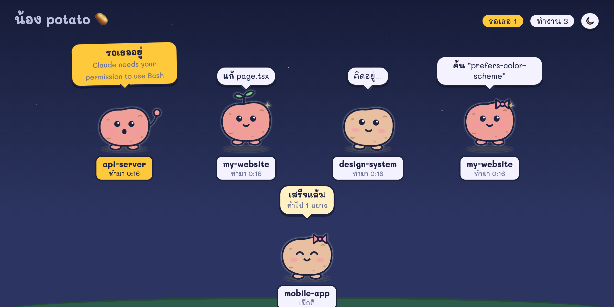

# น้อง potato 🥔

เปิด Claude Code หรือ Codex หลายตัวหลาย repo แล้วไม่รู้ว่าตัวไหนทำอะไรอยู่ ตัวไหนรอให้กดอนุญาต?
น้อง potato เปลี่ยนทุก session เป็นน้องตัวเล็กๆ ยืนเรียงกันบนหน้าเว็บ เปิดค้างไว้จอสองแล้วเหลือบดูได้ตลอด น้อง Codex มีป้ายสีเขียวให้แยกจาก Claude Code



| น้องทำท่า | แปลว่า |
|---|---|
| เด้งดึ๋ง มีกล่องข้อความ "**แก้** page.tsx" | กำลังใช้ tool อยู่ พร้อมตัวจับเวลา |
| โยกตัว "คิดอยู่..." | กำลังคิด |
| กระโดดโบกมือ ป้ายสีเหลือง | **รอเธอ** ขออนุญาตหรือมีคำถาม (ย้ายมาอยู่ซ้ายสุดเสมอ) |
| ยิ้มตาหยี "เสร็จแล้ว!" | ทำงานเสร็จ บอกว่าทำไปกี่อย่างในกี่นาที |
| หลับ zZz | ว่างอยู่ |

- แต่ละ repo ได้สีของตัวเอง ถ้าเปิดหลาย session ใน repo เดียวกัน น้องจะได้หู เสาอากาศ ใบไม้ หรือโบว์ต่างกัน
- คลิกที่น้องเพื่อดูงานล่าสุด ประวัติว่าทำอะไรไปบ้าง และปุ่มเปิด repo ใน VS Code
- ชื่อแท็บบอกสถานะด้วย เช่น `🙋 1 รอเธอ`
- ฉากกลางคืนมีดาวตาม dark mode ของเครื่อง หรือกดปุ่ม ☀️/🌙 มุมขวาบนเพื่อสลับเอง (จำไว้ให้ครั้งหน้า)



## ติดตั้ง

ต้องมี [Bun](https://bun.sh), `jq` และ `curl` ใช้ได้บน macOS กับ Linux

```bash
git clone https://github.com/poomp5/potato-claude.git
cd potato-claude
./install.sh          # ใส่ hook ใน Claude Code และ Codex (ใช้ได้ทุก repo)
bun server.ts         # แล้วเปิด http://localhost:4747
```

Codex จะขอให้ตรวจและ trust hook ก่อนเริ่มส่งสถานะ ให้เปิด Codex แล้วใช้ `/hooks` จากนั้นเลือก trust hook ของน้อง potato

ถ้าอยากให้ server เปิดเองทุกครั้งที่ login (macOS) ให้ใช้ `./install.sh --autostart`

session ที่เปิดอยู่แล้วจะเริ่มส่ง event หลังจากใช้ tool ครั้งถัดไป ถ้าน้องยังไม่โผล่ ลองเปิด session ใหม่

อยากเห็นน้องครบทุกท่าโดยไม่ต้องรอ Claude ทำงานจริง:

```bash
./demo.sh         # ส่งน้องตัวอย่างเข้าไป
./demo.sh clear   # ล้างออก
```

### ถอนการติดตั้ง

```bash
./uninstall.sh
```

เอาเฉพาะ hook ของน้อง potato ออก hook อื่นที่มีอยู่แล้วไม่โดนแตะ ทั้ง `install.sh` และ `uninstall.sh` จะ backup `settings.json` ไว้ข้างๆ ก่อนแก้ทุกครั้ง

## ทำงานยังไง

```
Claude Code ──hook──▶ hook.sh ──┐
                               ├──▶ server.ts (127.0.0.1:4747) ──SSE──▶ index.html
Codex ──hook──▶ codex-hook.sh ──┘
```

- `install.sh` ลงทะเบียน `hook.sh` กับ Claude Code และ `codex-hook.sh` กับ Codex โดยเก็บ hook อื่นที่มีอยู่แล้วไว้ และ backup ไฟล์ตั้งค่าก่อนแก้
- `hook.sh` ส่ง JSON ของ hook ต่อไปให้ server ถ้า server ไม่ได้รัน curl จะล้มเหลวทันทีแล้วจบ ไม่ทำให้ Claude ช้าลง และไม่ไปยุ่งกับการขออนุญาตใดๆ
- `codex-hook.sh` ส่ง event ของ Codex แบบ asynchronous ไปยัง server และไม่เปลี่ยนการตัดสินใจเรื่อง permission
- `server.ts` เก็บสถานะของแต่ละ session ไว้ใน memory และใน `state.json` แล้วส่งต่อให้หน้าเว็บแบบ real-time ชื่อ repo กับ branch ได้มาจาก `git` ใน `cwd` ของ session

## ความเป็นส่วนตัว

- server ฟังเฉพาะ `127.0.0.1` ไม่มีอะไรออกไปนอกเครื่อง
- request ที่มี header `Origin` (คือมาจากหน้าเว็บอื่นในเบราว์เซอร์) จะถูกปฏิเสธ เว็บแปลกๆ จึงปลอมน้องเข้ามาไม่ได้
- สิ่งที่เก็บมีแค่ prompt ล่าสุดแบบตัดสั้น และประวัติ tool 12 รายการล่าสุดต่อ session session ที่เงียบไปเกิน 12 ชั่วโมงจะถูกลบทิ้ง

## ตั้งค่า

| ตัวแปร | ค่าเริ่มต้น | ใช้ทำอะไร |
|---|---|---|
| `NONG_POTATO_PORT` | `4747` | port ของ server (ถ้าเปลี่ยน ต้องตั้งให้ทั้ง server และ environment ของ Claude Code) |
| `CLAUDE_SETTINGS` | `~/.claude/settings.json` | ไฟล์ settings ที่ install/uninstall จะแก้ |
| `CODEX_HOOKS` | `~/.codex/hooks.json` | ไฟล์ hooks ของ Codex ที่ install/uninstall จะแก้ |

Linux ที่อยากให้เปิดเองตอน login: สร้าง systemd user service ที่รัน `bun /path/to/potato-claude/server.ts`

---

## English

**น้อง potato** ("Nong Potato") is a tiny always-on dashboard for people running Claude Code and Codex sessions across repos. Every session becomes a little creature that bounces while it works, raises its hand when it needs permission, cheers when it finishes, and falls asleep when idle. Leave it open on a second monitor.

```bash
git clone https://github.com/poomp5/potato-claude.git && cd potato-claude
./install.sh      # adds hooks to Claude Code and Codex; existing hooks are kept
bun server.ts     # open http://localhost:4747
./demo.sh         # optional: fake sessions to see every mood
```

Requires Bun, jq and curl (macOS/Linux). In Codex, review and trust the new hook from `/hooks`. The UI is in Thai. `./uninstall.sh` removes only this project's hooks. Everything stays on `127.0.0.1`.

## License

MIT
